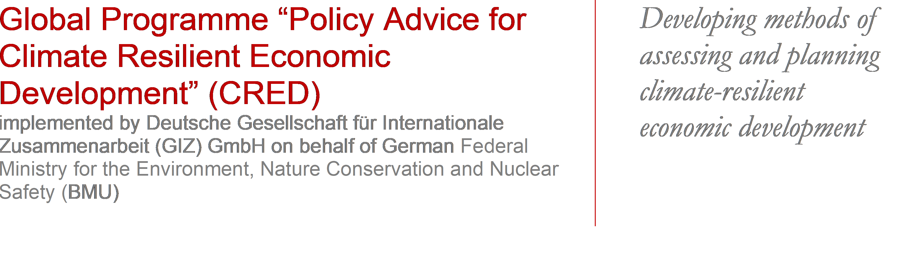
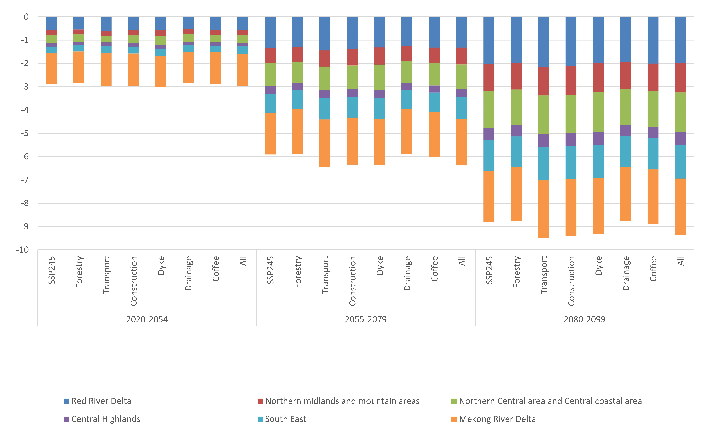

# Dynamic General Equilibrium Model for Climate Resilient Economic Development (DGE-CRED)
> This repository contains a spatial small open economy dynamic general equilibrium model implemented by the Halle Institute for Economic Research (IWH) in Dynare using Matlab/Octave as software.

## Disclaimer

## Installation

To use the model just download the repository and follow the instructions provided in the [documentation](https://github.com/schultkr/DGE-CRED/blob/master/DGE-CRED%20Model%20Technical%20Report.pdf).
Further, an example excel workbook with a description of the different variables is avaialable [here](https://github.com/schultkr/DGE-CRED/blob/master/DGE_CRED_Model/ExcelFiles/ModelSimulationandCalibration17Sectorsand6Regions.xlsx).

### Octave
The code only works for Octave 8.1.0 together with dynare 5.4. The dynare command check does not work in Octave. It is not possible to verify whether Blanchard -Kahn conditions are verified. Functions CreateRawExcelInputFileRobust.m and UpdateDataExcelRobust.m do not work with Octave.

## Scenario Simulation

The model can be used to simulate different climate change scenarios. Therefore one first defines a Baseline scenario and various climate change scenarios. 

_For more examples on using dynare, please refer to the website of [Dynare](https://www.dynare.org/)._

## Release History

* 0.0.1
  1.0.0

## Contact

Christoph Schult – christoph.schult@iwh-halle.de

[https://github.com/schultkr/](https://github.com/schultkr/)

<!-- Markdown link & img dfn's -->
[npm-image]: https://img.shields.io/npm/v/datadog-metrics.svg?style=flat-square
[npm-url]: https://npmjs.org/package/datadog-metrics
[npm-downloads]: https://img.shields.io/npm/dm/datadog-metrics.svg?style=flat-square
[travis-image]: https://img.shields.io/travis/dbader/node-datadog-metrics/master.svg?style=flat-square
[travis-url]: https://travis-ci.org/dbader/node-datadog-metrics
[wiki]: https://github.com/yourname/yourproject/wiki
