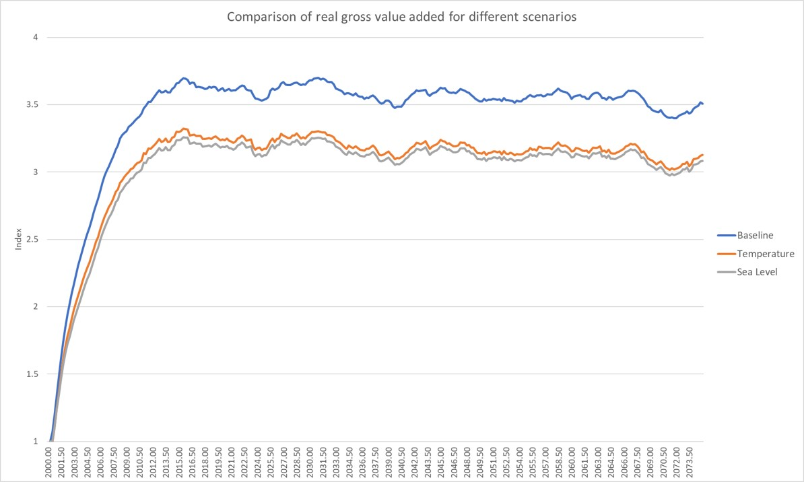

# Dynamic General Equilibrium Model for Climate Resilient Economic Development (DGE-CRED)
> This repository contains a spatial small open economy dynamic general equilibrium model implemented in Dynare using Matlab/Octave as software by the Halle Institute for Economic Research (IWH).

## Installation

To use the model just download the repository and follow the instructions provided in the [documentation](https://github.com/schultkr/DGE-CRED/blob/master/Model%20Description.pdf).

## Scenario Simulation

The model can be used to simulate different climate change scenarios. Therefore one first defines a Baseline scenario and climatechange scenarios. 

_For more examples on using dynare, please refer to the website of [Dynare](https://www.dynare.org/)._

## Release History

* 0.0.1
    * Work in progress

## Contact

Christoph Schult – christoph.schult@iwh-halle.de

[https://github.com/schultkr/](https://github.com/schultkr/)

## Contributing

1. Fork it (<https://github.com/yourname/yourproject/fork>)
2. Create your feature branch (`git checkout -b feature/fooBar`)
3. Commit your changes (`git commit -am 'Add some fooBar'`)
4. Push to the branch (`git push origin feature/fooBar`)
5. Create a new Pull Request

<!-- Markdown link & img dfn's -->
[npm-image]: https://img.shields.io/npm/v/datadog-metrics.svg?style=flat-square
[npm-url]: https://npmjs.org/package/datadog-metrics
[npm-downloads]: https://img.shields.io/npm/dm/datadog-metrics.svg?style=flat-square
[travis-image]: https://img.shields.io/travis/dbader/node-datadog-metrics/master.svg?style=flat-square
[travis-url]: https://travis-ci.org/dbader/node-datadog-metrics
[wiki]: https://github.com/yourname/yourproject/wiki
