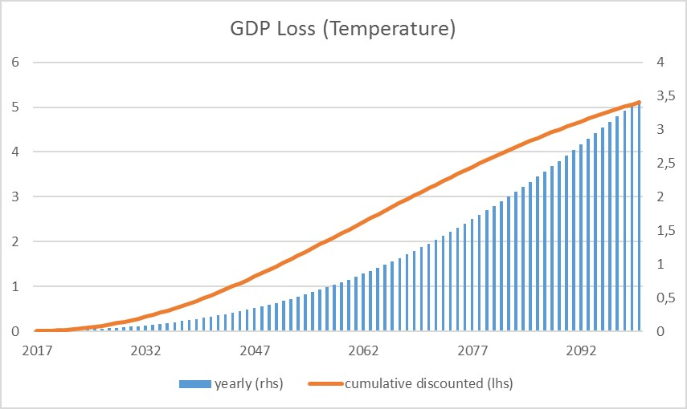

# Dynamic General Equilibrium Model for Climate Resilient Economic Development (DGE-CRED)
> This repository contains a spatial small open economy dynamic general equilibrium model implemented in Dynare using Matlab/Octave as software by the Halle Institute for Economic Research (IWH).

## Installation

To use the model just download the repository and follow the instructions provided in the [documentation](https://github.com/schultkr/Vietnam_RBC_model/blob/master/Model%20Description.pdf).

## Scenario Simulation

The model can be used to simulate different climate change scenarios. Therefore one first defines a Baseline scenario and climatechange scenarios. 

_For more examples on using dynare, please refer to the website of [Dynare](https://www.dynare.org/)._

## Release History

* 0.0.1
    * Work in progress

## Contact

Christoph Schult – christoph.schult@iwh-halle.de

[https://github.com/schultkr/](https://github.com/schultkr/)

## Contributing

1. In order to collaborate on Github everyone needs to have an account. In order to see a private repository this step has been done already.
2. Download the [Github desktop app](https://desktop.github.com/). 
3. Click in the browser on the repository site on the green button clone or download repository and click on open in desktop.

4. You can now see the repository in your gihub desktop app and access all files in your explorer (Strg + Shift + F).
5. You can upload changes to the online repository by commiting changes (Step 1) and then click fetch to origin (Step 2). 

<!-- Markdown link & img dfn's -->
[npm-image]: https://img.shields.io/npm/v/datadog-metrics.svg?style=flat-square
[npm-url]: https://npmjs.org/package/datadog-metrics
[npm-downloads]: https://img.shields.io/npm/dm/datadog-metrics.svg?style=flat-square
[travis-image]: https://img.shields.io/travis/dbader/node-datadog-metrics/master.svg?style=flat-square
[travis-url]: https://travis-ci.org/dbader/node-datadog-metrics
[wiki]: https://github.com/yourname/yourproject/wiki
